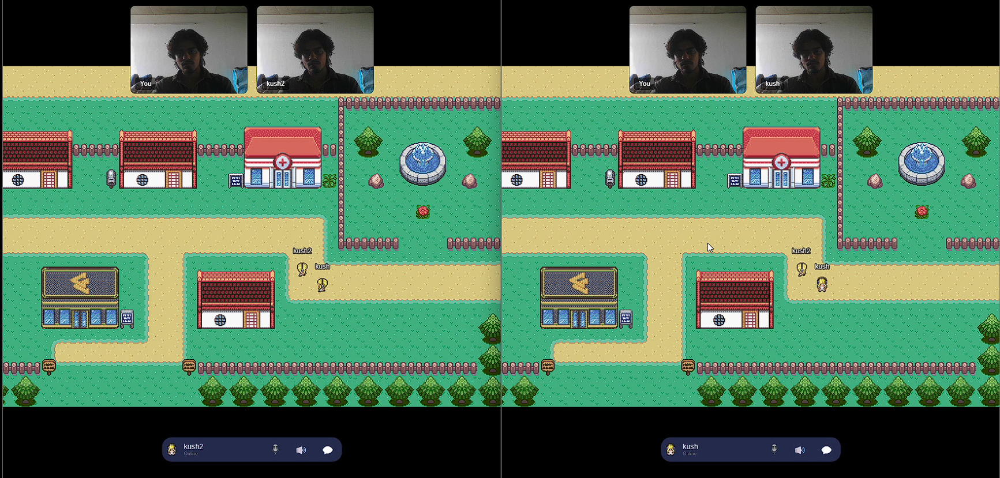

# Virtual Space

A real-time virtual meeting space where users can move around, interact, and communicate through proximity-based voice chat and messaging.



## Features

- **2D Virtual Environment** - Navigate through a shared virtual space
- **Proximity-based Voice Chat** - Automatic voice connection when users are near each other
- **Real-time Messaging** - Chat with other users in the space
- **Multi-user Support** - Multiple users can join and interact simultaneously

## Technologies Used

- **Frontend**: Phaser.js for 2D game rendering
- **Real-time Communication**: Socket.IO for instant messaging and user coordination
- **Voice Chat**: PeerJS & WebRTC for peer-to-peer audio connections
- **Backend**: Node.js with Socket.IO server

## Getting Started

### Prerequisites
- Node.js (v14 or higher)
- Modern web browser with WebRTC support

### Installation

1. Clone the repository
```bash
git clone https://github.com/yourusername/virtual-space.git
cd virtual-space
```

2. Install dependencies
```bash
npm install
```

3. Start the server
```bash
npm start
```

4. Open your browser and navigate to `http://localhost:3000`

## How to Use

1. Enter your name when prompted
2. Use arrow keys or WASD to move your avatar
3. Get close to other users to automatically start voice chat
4. Use the chat box to send text messages
5. Move away to disconnect voice chat

## Contributing

Feel free to submit issues and pull requests to improve the project.

## License

MIT License
